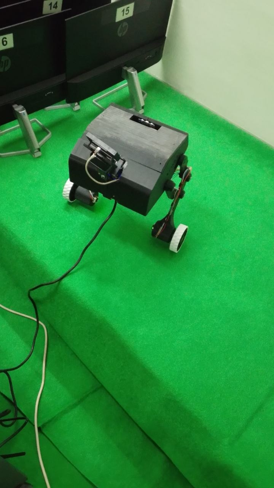

# Ishara — Raspberry Pi Sign Language Recognition

The perception and inference half of **Ishara**, a self-balancing robot that
recognises Bangla Sign Language words in real time. Built as an undergraduate
thesis project, Dept. of CSE, Khulna University of Engineering & Technology.

This code runs on a Raspberry Pi 5: it captures video, extracts pose and hand
landmarks with MediaPipe, classifies signed words with a Transformer model,
speaks the result aloud, and drives the robot through a serial link to an
STM32F411 that handles balancing and motor control.

<!-- Put your photo at images/robot.jpg (create the folder in the repo root). -->
<p align="center">
  
</p>

---

## What it does

Point the camera at someone signing and the robot recognises the word, shows a
transliteration on its OLED, and speaks it. A raised hand acts as a gesture
control, so the signer can start recognition, delete the last word, or have the
whole sentence read out without touching the robot. It can also follow a person
around the room, and everything is controllable from a phone browser over the
robot's own WiFi hotspot.

---

## Hardware

| Component | Detail |
|---|---|
| Compute | Raspberry Pi 5 |
| Camera | USB / CSI camera |
| Motion controller | STM32F411 over serial (separate repository) |
| Display | 128×64 OLED, driven by the STM32 |
| Head servo | Pan servo on the Pi's GPIO |
| Audio | Speaker via PulseAudio / PipeWire |

---

## Recognition pipeline

```
camera → MediaPipe (pose + hands) → 300-dim feature vector
       → 64-frame rolling buffer → SignTransformer ×5 (ensemble)
       → softmax average → voting → word
```

**Landmarks, not pixels.** Each frame is reduced to 75 landmarks — 33 body pose
points plus 21 per hand — giving a 300-dimensional feature vector (75 × 3
coordinates plus a 75-length presence mask). Faces are deliberately excluded.
This keeps the model small enough to run on the Pi, since it never has to learn
to locate hands in an image.

**A rolling buffer, not clips.** Recognition doesn't record a fixed clip. The
camera thread continuously appends features to a 64-frame circular buffer, and
inference always runs on the most recent 64 frames.

**Voting, not single predictions.** A word is only accepted after the same class
is predicted 4 times with confidence above 0.55. This filters out the transient
misclassifications that occur while a sign is still forming.

---

## Model and results

`SignTransformer`: a per-frame spatial encoder, learned positional embedding, a
4-layer Transformer encoder, attention pooling, and a linear classifier.
**927,719 parameters** per model; five seeds are averaged at inference.

Evaluated on BdSLW102 (102 word classes), stratified 15% test split:

| Model | Params | Top-1 | Top-5 | Macro-F1 |
|---|---|---|---|---|
| 128-width, 5-seed ensemble | 0.93 M | 0.772 | 0.913 | 0.773 |
| 192-width, 5-seed ensemble | 2.88 M | 0.804 | 0.924 | 0.805 |

Measured inference latency on the Pi 5 (CPU only): **87 ms** for a single model,
**404 ms** for the 5-seed ensemble.

The spatial encoder is warm-started from a model pretrained on BdSLW131 static
images before the temporal model is trained on video — a cross-modality transfer
step worth about 5 points of top-1 accuracy over training on video alone.

---

## Operating modes

| Mode | Behaviour |
|---|---|
| **idle** | Waiting. Head servo parked. |
| **recognition** | Tracks the signer's face, recognises words, builds a sentence |
| **following** | Follows a person using shoulder width for distance and horizontal offset for steering, with the sonar as a safety stop |
| **manual** | Direct driving from the keyboard or phone dashboard |

In recognition mode, raising the left or right hand triggers the gesture
commands (recognise / delete / speak). The same actions are available as buttons
on the phone dashboard, sharing the same code path so both behave identically.

---

## Repository layout

Modules are layered — nothing lower ever imports something higher, which is why
there are no circular imports despite everything sharing state.

**Entry point**

| File | Purpose |
|---|---|
| `robot_phase4.py` | Starts every thread, handles shutdown, keyboard control |

**Foundation**

| File | Purpose |
|---|---|
| `config.py` | All paths, thresholds, and tuning constants |
| `state.py` | The shared dictionary and lock every thread reads and writes |

**Hardware and I/O**

| File | Purpose |
|---|---|
| `link.py` | Serial transport to the STM32 |
| `protocol.py` | Framed protocol encode/decode |
| `robot_io.py` | The `robot` facade: movement, arms, OLED, balance, calibration |

**Perception and inference**

| File | Purpose |
|---|---|
| `perception.py` | MediaPipe pose and hand detection, landmark normalisation |
| `model.py` | SignTransformer definition, checkpoint loading, ensemble prediction |
| `capture.py` | Camera thread: continuous capture, landmark extraction, rolling buffer |
| `gestures.py` | Hand-state detection and sliding-window prediction helpers |

**Behaviour**

| File | Purpose |
|---|---|
| `modes.py` | Mode state machine, sentence buffer, voting loop, person following |
| `headtracking.py` | Pan-servo PD controller that keeps the signer centred |
| `audio.py` | Speaks recognised words and sentences |
| `text_bengali.py` | Bengali → Latin transliteration for the OLED |

**Interface**

| File | Purpose |
|---|---|
| `webui.py` | HTTP server, phone dashboard, MJPEG video stream, REST endpoints |

**Assets**

| Folder | Contents |
|---|---|
| `assets/` | MediaPipe `.task` models |
| `checkpoints/` | Trained model weights |
| `audio/` | Pre-recorded word audio |
| `Word Label.xlsx` | Class ID → Bengali word mapping |

---

## Setup

On Raspberry Pi OS (Bookworm), Pi 5:

```bash
sudo apt install libgl1 libglib2.0-0 pulseaudio-utils python3-lgpio

conda create -n bdsl python=3.11 -y
conda activate bdsl

pip install numpy scipy opencv-python mediapipe openpyxl pyserial \
            gpiozero rpi-lgpio torch torchvision
```

The Pi 5 needs `lgpio` rather than the older RPi.GPIO backend.

Set `BASE` in `config.py` to wherever you cloned the repository, and check
`SERIAL_PORT` matches the STM32's device path.

---

## Running

```bash
conda activate bdsl
python robot_phase4.py
```

Keyboard shortcuts in the preview window: `i` idle, `r` recognition, `f`
following, `m` manual, `WASD` to drive, `q` to quit.

The phone dashboard is served on port 8000. When the Pi is running as a WiFi
hotspot it's usually at `http://10.42.0.1:8000`.

To start it automatically at boot with the preview window visible, use a desktop
autostart entry rather than a systemd service — a background service has no
display, and OpenCV's window will abort the process on startup.

---

## Notes

Some folders in this repository (`working files/`, `changed files/`,
`habijabi code/`) are development scratch space rather than part of the running
system. The active code path is `robot_phase4.py` and the modules it imports.

`link.py` and `protocol.py` also contain a framed protocol with sequence numbers
and acknowledgements. It is implemented and tested but not currently used — the
robot runs on the simpler line-based commands.

---

## Related repositories

The STM32 firmware — balance control, motor drivers, encoders, and the serial
command protocol this code talks to — lives in a separate repository.